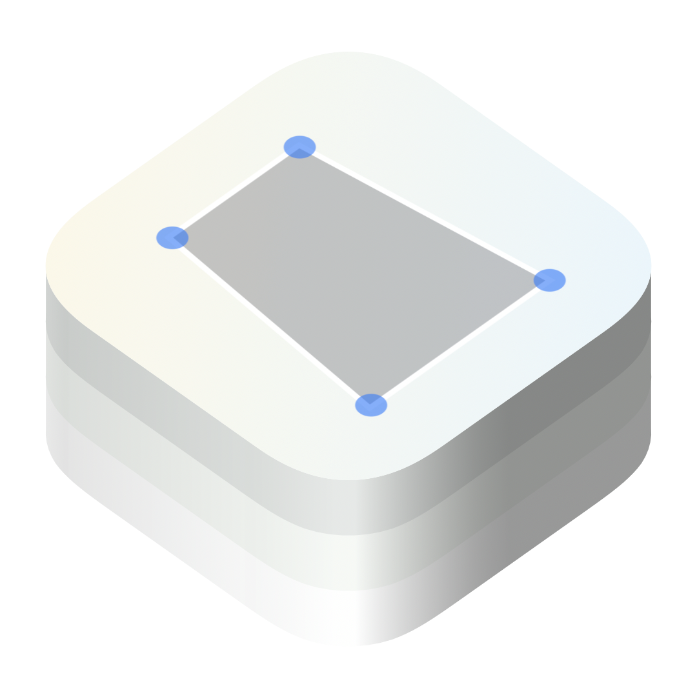
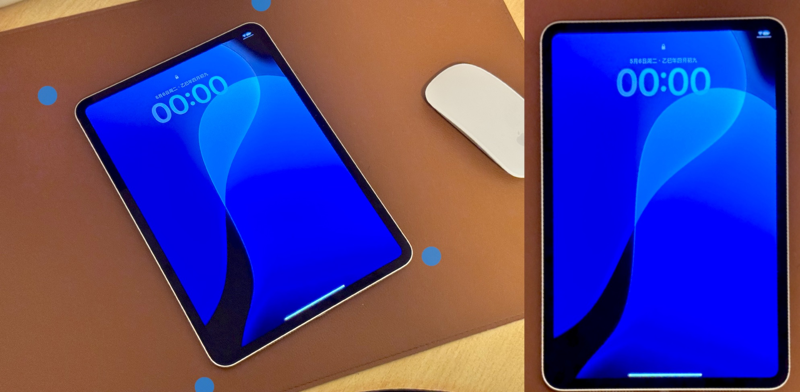

# Perspective

Simple view modifier to warp perspective of any SwiftUI view.

High performance, real-time distortion filter powered by Metal.

## Platforms

- iOS 17.0+
- macOS 14.0+
- tvOS 17.0+

## Usage

You can use `warpPerspectiveEffect(topLeftPoint:bottomLeftPoint:bottomRightPoint:topRightPoint:)` on any SwiftUI view.

```swift
@State private var topLeft: CGPoint = CGPoint(x: 0, y: 0)
@State private var bottomLeft: CGPoint = CGPoint(x: 0, y: 1)
@State private var bottomRight: CGPoint = CGPoint(x: 1, y: 1)
@State private var topRight: CGPoint = CGPoint(x: 1, y: 0)

ContentView()
    .warpPerspectiveEffect(
        topLeftPoint: topLeft,
        bottomLeftPoint: bottomLeft,
        bottomRightPoint: bottomRight,
        topRightPoint: topRight
    )
```

It can also be used as an image filter, equivalent to `CIPerspectiveCorrection` from Core Image.

Here is an example:



### Credits

The calculation part of this package uses the algorithm from:

* [Perspective transform from quadrilateral to quadrilateral in Swift](https://rethunk.medium.com/perspective-transform-from-quadrilateral-to-quadrilateral-in-swift-5a9adf2175c3)
* [Perspective transform from quadrilateral to quadrilateral in Swift using SIMD for matrix operations](https://rethunk.medium.com/perspective-transform-from-quadrilateral-to-quadrilateral-in-swift-using-simd-for-matrix-operations-15dc3f090860)

Credits has been included in the source file.
